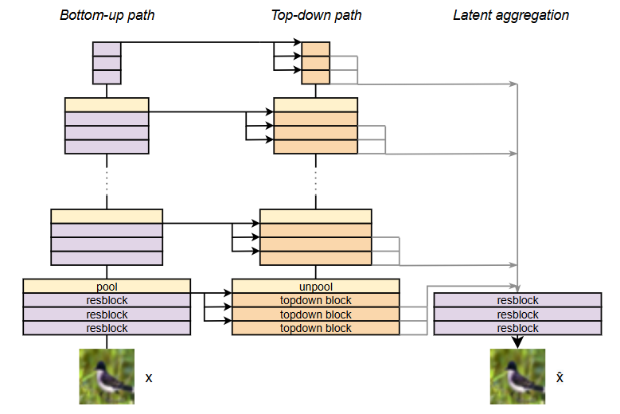
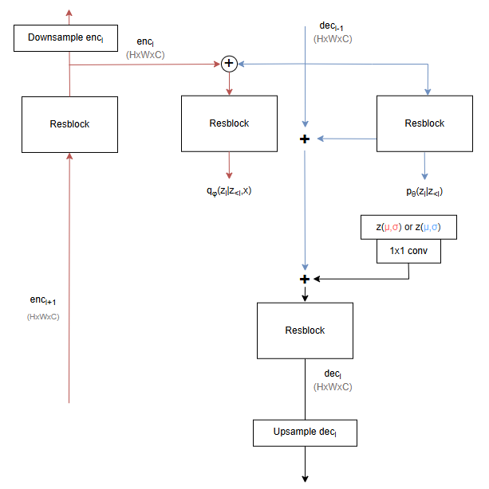
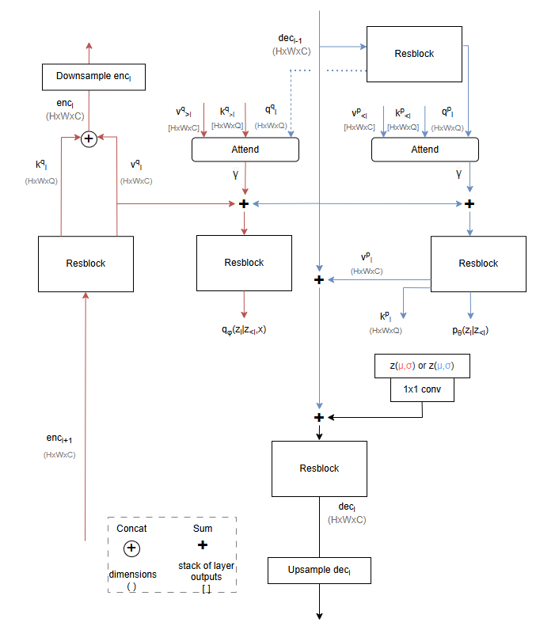

# 🧠 Hierarchical Variational AutoEncoder (HVAE) with Flow layers and Depthwise Attention

This repository contains a from-scratch Keras3 implementation of a HVAE with the following properties:

- Compatible with [Jax, Tensorflow, Torch and OpenVINO](https://keras.io/keras_3/) backends  
- [VDVAE base](https://github.com/openai/vdvae) (reproduced results)  
- Gradient smoothing, gradient skipping and extensive configurability as in [EfficientVDVAE](https://github.com/Rayhane-mamah/Efficient-VDVAE)  
- Latent aggregation as in [DVP_VAE](https://github.com/AKuzina/dvp_vae)  
- [Optional] [Sylvester flow](https://github.com/riannevdberg/sylvester-flows) at every layer  
- [Optional] [Generalized Sylvester flows](https://github.com/ehoogeboom/convolution_exponential_and_sylvester) at every layer  
- [Optional] Depthwise attention, previously only implemented on [NVAE](https://github.com/NVlabs/NVAE) in [DAVI](https://github.com/ifiaposto/Deep_Attentive_VI)  
- [Optional] Consistency regularization of the [CR-VAE](https://github.com/sinhasam/CRVAE)  

## 📦 Version

Repository was last tested with:

| Component | Version |
| --- | ---: |
| Python | 3.12.11 |
| Keras | 3.12.0 |
| Numpy | 1.26.4 |
| Jax | 0.5.2 |
| TensorFlow | 2.19.0 |
| Torch | 2.6.0 + cu124 |

## 🏗️ Architecture

The default architecture is the same as in the [VDVAE Figure 3](https://arxiv.org/pdf/2011.10650), but with the addition of the latent aggregation as shown in [DVP-VAE Figure 2](https://arxiv.org/pdf/2412.01373).

This means that rather than using the feature maps from the hierarchy, the latents __z__ are collected and summed for reconstruction, as shown below.



Below the inside of the encoder block is shown in red, with a decoder (top-down) block shown in blue, this is the same as the [VDVAE](https://github.com/openai/vdvae) base:



This baseline can be used with flow layers, depthwise attention, and consistency regularization, that are all modular and compatible.

### 🌊 Flow layers

If a flow is present in the current block, it is applied to output distribution $q_\phi(z_l|z_{<l},x)$, meaning flows are only used for inference, and are not part of the prior $p_\theta(z_l|z_{<l})$. This is the same as in [NVAE](https://github.com/NVlabs/NVAE) (which uses Inverse Autoregressive Flows) and the [Sylvester flow](https://github.com/riannevdberg/sylvester-flows) repository.

Since the original [Sylvester flow](https://github.com/riannevdberg/sylvester-flows) is defined as a linear/fully connected layer, it does not scale well with Hierarchical VAEs, as the latents have the size of the data-dimension. I only implemented the `OrthogonalSylvesterFlow`, since it has the lowest parameter count with this constraint.  
The idea was to only put a flow on the deepest (lowest resolution/scale) layers to keep the number of parameters manageable, but the number of flow parameters quickly overtook that of the rest of the model.

Because of this I also implemented the [Generalized Sylvester](https://github.com/ehoogeboom/convolution_exponential_and_sylvester) in `model/conv_sylvester_flow`, that operates with convolutional layers, allowing for flow layers regardless of the scale. A bug was created in the conversion process from torch to keras3, which sometimes results in a negative KL-divergence. __This bug is still present__.  

> *Note:* `ActNorm` layers are initialized at 0, with LDJ=0, otherwise the model becomes unstable at initialization.

### 👁️ Depthwise Attention

The original [DAVI](https://github.com/ifiaposto/Deep_Attentive_VI) implementation was done on [NVAE](https://github.com/NVlabs/NVAE) and never tested with the [VDVAE](https://github.com/openai/vdvae) architecture. At some point, spatial attention was implemented in this repository but it brought a large memory cost and came with negligible improvement. I expect that this is because we use many more scales (resolutions) in [VDVAE](https://github.com/openai/vdvae), such that the global and local features are expressed more easily without the need for attention.  
The depthwise attention implementation, if enabled, replaces the blocks with the image below (encoder in red, decoder in blue):



The encoder, at the end of every scale before pooling, outputs `keys` and `values`. The `values` are connected as residual (which retains the [VDVAE](https://github.com/openai/vdvae) structure, but where we separate from the original [DAVI](https://github.com/ifiaposto/Deep_Attentive_VI) implementation on [NVAE](https://github.com/NVlabs/NVAE))

The `keys` and `values` are up- and down-sampled throughout the scales of the model without loss of information, and every decoder block now contains a resblock to produce `queries`. Both the red inference chain (for $q_\phi$) and the blue prior chain (for $p_\theta$) gain an attention block, of which the output is added to the residual with magnitude parameter $\gamma$, which is trainable and initialized at 0. This is the same as in [DAVI](https://github.com/ifiaposto/Deep_Attentive_VI).

## 🚀 Repository Usage

You can train your own model by running `main.py`, which contains an argumentparser that defines the model, dataset, and training parameters. While the final model is compatible with Jax, Pytorch, Tensorflow and OpenVINO, the training loop is implemented with the tensorflow backend (`tf.GradientTape`), since this is required in Keras3 at the moment of writing this code.

In the current method the model is not serialized, and we only [checkpoint](https://keras.io/api/callbacks/model_checkpoint/) the weights at the end of every epoch. To load a model you can use `load_model.py`.

If you want to train with your own data, you should add a file in the `data` folder that is compatible with the format of `dataloader.py`, then add the specifications to `utils/config_params.py` under the function `add_dataset_context`.

### ▶️ Running main.py

There are three ways of running the code and training your model: through the terminal, through a config file, or by simply editing the default values of the argumentparser in `main.py`.

$\boxed{Terminal:}$ add a change from the default value as a flag and run:
```
python main.py --batch_size 16
```

$\boxed{Config:}$ create a `.yaml` file in cfg and define your parameters in a similar way to the examples. This example reproduces the `cifar10` run of the [VDVAE](https://github.com/openai/vdvae):
```
python main.py --config "cifar10"
```

$\boxed{Main.py:}$ edit the default values in the parser here and run through terminal or your IDE.

## ⚙️ Parser Arguments

You can look inside main.py to see how the arguments are defined, or have a look at the list here.

### 🌐 General arguments

| Argument | Description |
| --- | --- |
| `backend` | which Keras3 backend to use, for now only tensorflow is implemented for training. |
| `dataset` | defines which dataset to train on. |
| `gpu` | string with number available gpu, can be multiple gpus. For example `"0, 1"` uses GPU 0 and 1 through `os.environ["CUDA_VISIBLE_DEVICES"]`. (I recommend using 1 GPU, as there are some instability issues) |
| `jit` | boolean, whether to use jit compilation for training or not. Defaults to true. |
| `save` | boolean whether to create a save folder and store weights, plots, etc. Defaults to true. |
| `save_dir` | string that should contain the path to store results in. |

---

### 🧩 Model parameters

| Parameter | Description |
| --- | --- |
| `b_act` | the activation function used in the residual blocks of the model, can be any of [these](https://keras.io/api/layers/activations/#available-activations), defaults to `silu`/`swish`. |
| `p_act` | activation function done after a pooling layer, which can contain a convolution if the channel width changes, this is done in the [EfficientVDVAE](https://github.com/Rayhane-mamah/Efficient-VDVAE). Defaults to `silu`/`swish`. |
| `block_gn` | boolean to turn on GroupNorm (8 groups) in residual blocks, I did not notice any effect. |
| `depthwise` | boolean, if true replaces the 3x3 convolutions in the ResNet blocks of the [VDVAE](https://github.com/openai/vdvae) with 5x5 depthwise convolutions of the [NVAE](https://github.com/NVlabs/NVAE). |
| `num_output_mixtures` | number of mixtures per channel when using the Discretized Mix of Logistic Functions. |
| `init_zeros` | boolean, if this flag is raised, the decoder does not start with a bias value for creating the image, but with zeros. (at the 1x1 scale) |
| `increase_kernelsize` | rather than using 3x3 convs at every scale, uses larger kernel sizes for larger scales to see if this improves performance for high-res images. |

> *Note:* The following parameters are defined by lists that need either 1 value, or have a value for every scale in the dataset. Example: Cifar10 is 32x32, which has 6 scales; `32x32`, `16x16`, `8x8`, `4x4`, `2x2`, `1x1`. The list can have 1 value which is repeated for all scales, or you can have 6 values. This list structure is the same for the flow parameters.

| Parameter | Description |
| --- | --- |
| `stage_in_width` | number of channels for the outer part (1x1 convs) of the ResNet blocks of a certain scale. (For depthwise attention, the number of channels of the values `v`). |
| `enc_middle_width` | number of channels for the inner part of the ResNet blocks (3x3 convs) in the encoder. |
| `dec_middle_width` | number of channels for the inner part of the ResNet blocks (3x3 convs) in the decoder. |
| `z_width` | number of channels a latent has for every scale. For example, `4` at scale 32x32 makes for a latent of `32x32x4` in every decoder block. |
| `enc_num_blocks` | the number of blocks at every scale of the encoder. Note that these can be set to 0 inbetween other scales, [1, 1, 0, 0, 1, 1] works perfectly fine. |
| `dec_num_blocks` | the number of blocks at every scale of the decoder. These do not need to be the same as `enc_num_blocks` but can be whatever you want. |

---

### 🧱 Parameters of the reconstruction head (latent aggregation)

| Parameter | Description |
| --- | --- |
| `output_blocks` | single integer, represents the number of ResNet blocks applied to the output of all latents. |
| `z_out_width` | number of outer channels (1x1 convs) of these ResNet blocks. |
| `z_out_middle_width` | number of inner channels (3x3 convs) of these ResNet blocks. |

---

### 🔀 Flow parameters

| Parameter | Description |
| --- | --- |
| `flow_type` | string that can be `none`, `sylvester` or `conv_sylvester`. `sylvester` enables the [linear, orthogonal version](https://github.com/riannevdberg/sylvester-flows) of the sylvester flow, `conv_sylvester` the [generalized version](https://github.com/ehoogeboom/convolution_exponential_and_sylvester). Set to none by default. |
| `num_flows` | Number of flows layers per block, defined at every scale. (this is again a list of integers). The integer is used for the `sylvester` flow, while acting as a boolean per scale for `conv_sylvester`. |

*Parameters for `flow_type = sylvester`:*

| Parameter | Description |
| --- | --- |

| `flow_in_ch` | The number of channels of *h* at every scale. This relates to the size and number of parameters of the flow; at scale `32x32` a value of 3 will give an input to the sylvester flow of `32x32x3` (flattened). |
| `num_ortho_vecs` | Number of orthogonal vectors of the sylvester flow at every scale. |

---

*Parameters for `flow_type = conv_sylvester`:*

---

| Parameter | Description |
| --- | --- |
| `spectral_norm` | enable spectral normalization for the convolutional sylvester flows. |
| `convsylv_channels` | the number of channels of the convolutions in the flows (List of integers, defined per scale). |
| `convsylv_flows_per_stage` | the number of repetitions of: `ActNorm -> Sylvester Flow -> Flip` before a split. (List of integers, defined per scale). Defaults to 1, haven't explored the impact yet. |
| `convsylv_splitfirst` | list of booleans per scale, if 1 at a scale it will perform split first. The effect of this is that `32x32x16` gets split into `32x32x8` before processing. The idea here is that the model does not require the complexity of 16 flowed dimensions, and better learns to allocate resources. This means the final latent has samples from 8 diagonal covariance gaussian channels and 8 channels of flowed samples in its final latent. |
| `convsylv_stage_limit` | this caps the number of splits a scale can have (List of integers). Example, if set to 3 for scale `32x32`, the flow dimensions become for example `32x32x4 -> 16x16x16 -> 8x8x64`, instead of going all the way to `1x1`. This reduces parameter count at the cost of latent mixing, which we expect is already sufficiently present in the [VDVAE](https://github.com/openai/vdvae). |

---

### 🎯 Attention parameters

| Parameter | Description |
| --- | --- |
| `use_depthwise_attention` | boolean, if true enables depthwise attention across the hierarchy. |
| `query_width` | number of channels of the queries (the same for every scale). The key width is the same value. |
| `num_queries` | the number of queries every block produces, if more than 1, it will perform attention multiple times and combine the results with a 1x1 combination convolution, similar to multi-head attention. |

---

### 📈 Training parameters

| Parameter | Description |
| --- | --- |
| `batch_size` | batch size |
| `batch_size_div` | division of the batch that can be used when running out of memory. Example, if `batch_size` is 64 and `batch_size_div` is 2, the `batch_size` becomes 32, and the optimizer will perform 2 gradient accumulation steps before updating the weights. This will let you have a high batch size on high resolution images, something HierarchicalVAE's struggle with. |
| `cr_vae` | boolean, if enabled adds a [consistency-regularization](https://arxiv.org/pdf/2105.14859) loss to training. This is done by using half the original `batch_size` and concatenating the same batch with augmentations to it. |
| `cr_lambda` | float value for `lambda` of the [CR-VAE](https://github.com/sinhasam/CRVAE), magnitude of the loss term. |
| `cr_duplicate_noise` | boolean value, if enabled both the original and augmented version of the batch get the same noise in the resampling trick of the latent. This is so that throughout the hierarchy, the latent paths of the original and augmented versions do not diverge due to noise, this was not implemented in the original [CR-VAE](https://github.com/sinhasam/CRVAE), but I added it as an option. *Defaults to True* |
| `epochs` | epochs |
| `early_stopping` | integer, stops training after #epochs without improvement of validation loss. |
| `learning_rate` | learning rate |
| `learning_rate_end` | float, end learning rate of the learning rate scheduler. |
| `lr_warmup_epochs` | int, number of warmup epochs of the learning rate scheduler (only used for compatible schedulers). |
| `scheduler` | learning rate scheduler, most common for HVAEs is `cosd`. |
| `optimizer` | optimizer for training, all recent HVAE's use `adamax`. Note that in the Keras3 version of `adamax` the weight-decay is decoupled from momentum/learning rate updates as in `adamw`! |
| `weight_decay` | float value for weight_decay. |
| `use_ema` | boolean, if true uses a exponential moving average on the weights, defaults to true. |
| `gradient_smoothing` | value for $\beta$ in the SoftPlus function that is applied to $sigma$ of the latent and in the Mixture of Logistic Functions, as in [EfficientVDVAE](https://github.com/Rayhane-mamah/Efficient-VDVAE). |
| `gradient_clipnorm` | float value that clips the norm of a gradient that exceeds this value. Turns off if set to 0. |
| `gradient_skipnorm` | float value that skips the optimizer step if a gradient exceeds this value (gradient skipping as in [VDVAE](https://github.com/openai/vdvae) and [EfficientVDVAE](https://github.com/Rayhane-mamah/Efficient-VDVAE)). Turns off if set to 0, threshold is set after epoch 2, since gradient norms are much larger in the first epoch. |
| `beta` | float, maximum value for $\beta$ in: ELBO = rec + $\beta$ * KL. The default of 1 is standard in literature. (If you want a meaningful comparison) |
| `beta_warmup_epochs` | number of warmup epochs before reaching your $\beta$ value. Uses a linear scheduler. |
| `cyclic_beta` | boolean, if true uses a cyclic beta scheduler that increases and decreases $\beta$ multiple times, as in [Cyclical Annealing Schedule](https://arxiv.org/pdf/1903.10145). |
| `number_cycles` | number of cycles for the cyclic beta scheduler. Multiplies with the `beta_warmup_epochs`. Example: `beta_warmup_epochs=5`, `number_cycles=3`. First 2.5 epochs, anneals from 0 to `beta`, next 2.5 epochs stays at `beta`, next 2.5 epochs anneals from 0 to `beta`... For a total of 15 epochs, after which it stays at `beta` till training finishes. |
| `config` | name of the config file, defaults to `"None"`. If defined, overwrites all other arguments. |

> *Note:* For many configurations gradient skipping/clipping are unnecessary. If your specific architecture is unstable, you can try using these. The trainer always prints the real-time gradient norm and saves and plots it after training, incase you need to find a reasonable magnitude.

## Contributing 📝

If you find any bugs (or have any fixes) feel free to create a github issue or a PR.

You can always contact me at [s.w.penninga@tue.nl](mailto:s.w.penninga@tue.nl) if you have any questions!
